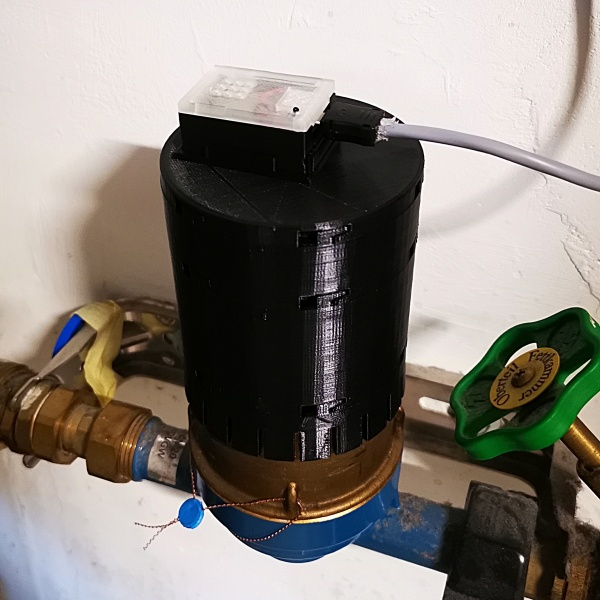
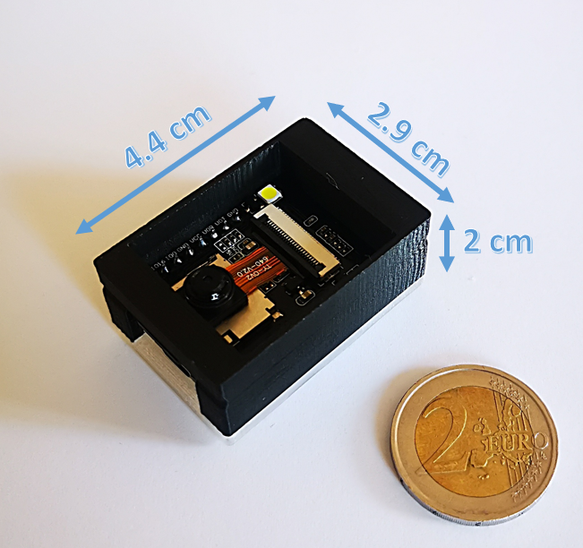
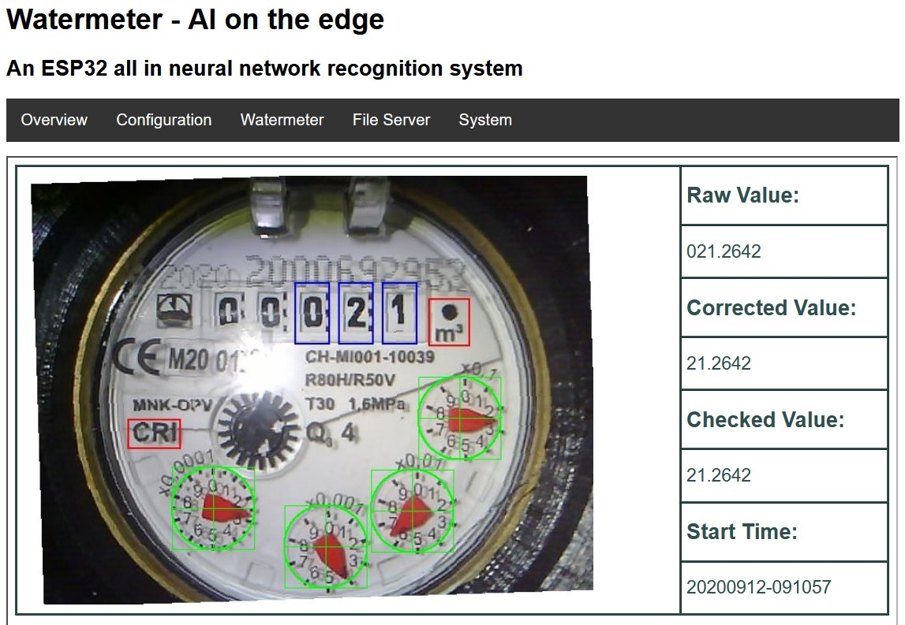
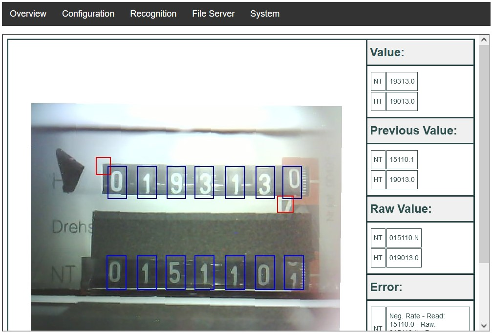
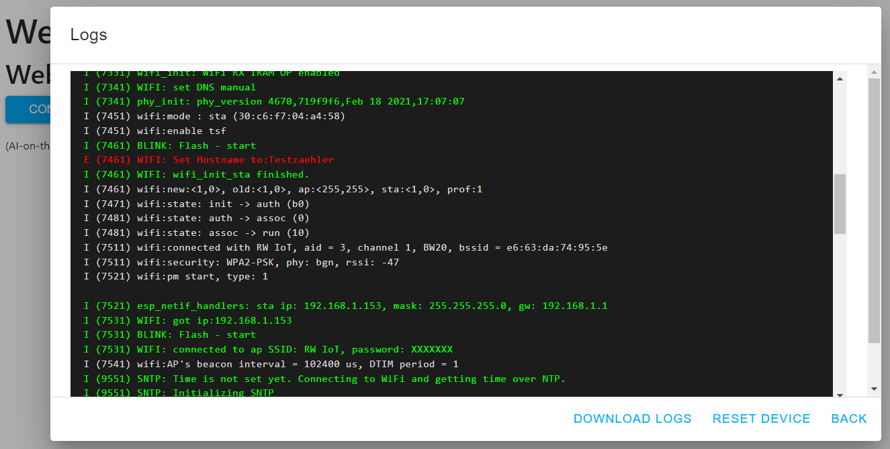

<h1 align="center">AI on the Edge Device: Digitizing Your non-digital meters with an ESP32-CAM</h1>
 
 

## Table of Contents
- [Key Features 🚀](#key-features-)
- [Workflow 🔧](#workflow-)
- [Impressions 📷](#impressions-)
  - [AI-on-the-edge-device on a Water Meter 💧](#ai-on-the-edge-device-on-a-water-meter-)
  - [Web Interface (Water Meter) 💻](#web-interface-water-meter-)
  - [AI-on-the-edge-device on an Electrical Power Meter ⚡](#ai-on-the-edge-device-on-an-electrical-power-meter-)
- [Setup 🛠️](#setup-%EF%B8%8F)
- [Download 🔽](#download-)
- [Flashing the ESP32 💾](#flashing-the-esp32-)
- [Flashing the SD Card 💾](#flashing-the-sd-card-)
- [Casing 🛠️](#casing-%EF%B8%8F)
- [Donate ☕](#donate-)
- [Support 💬](#support-)
- [Changes and History 📜](#changes-and-history-)
- [Build It Yourself 🔨](#build-it-yourself-)
- [Tools 🛠️](#tools-%EF%B8%8F)
- [Additional Ideas 💡](#additional-ideas-)
- [Our Contributors ❤️](#our-contributors-%EF%B8%8F)

    

  

Artificial intelligence is everywhere, from speech to image recognition. While most AI systems rely on powerful processors or cloud computing, **edge computing** brings AI closer to the end user by utilizing the capabilities of modern processors.  
This project demonstrates edge computing using the **ESP32**, a low-cost, AI-capable device, to digitize your analog meters—whether water, gas, or electricity. With affordable hardware and simple instructions, you can turn any standard meter into a smart device.

Let's explore how to make **AI on the Edge** a reality! 🌟

All you need is an [ESP32 board with a supported camera](https://jomjol.github.io/AI-on-the-edge-device-docs/Hardware-Compatibility/) and some practical skills. 🛠️

---

 

## Key Features 🚀
- 🔗 **Tensorflow Lite (TFLite) integration** – including an easy-to-use wrapper.
- 📸 **Inline image processing** (feature detection, alignment, ROI extraction).
- 💡 **Small** and **affordable** device (3 x 4.5 x 2 cm³, less than 10 EUR).
- 📷 Integrated camera and illumination.
- 🌐 Web interface for administration and control.
- 🔄 OTA interface for updating directly via the web interface.
- 🏠 Full integration with Home Assistant.
- 📊 Support for **Influx DB 1** and **2**.
- 📡 **MQTT protocol** support.
- 📥 **REST API** available for data access.

 

## Workflow 🔧
The device captures a photo of your meter at set intervals. It then extracts the Regions of Interest (ROIs) from the image and runs them through artificial intelligence. As a result, you get the digitized value of your meter.

There are several options for what to do with that value:
- 📤 Send it to a **MQTT broker**.
- 📝 Write it to an **InfluxDb**.
- 🔗 Provide access via a **REST API**.

   

---

 

## Impressions 📷

+ ### AI-on-the-edge-device on a Water Meter 💧
  

     
  

+ ### Web Interface (Water Meter) 💻
  

     
  

+ ### AI-on-the-edge-device on an Electrical Power Meter ⚡
  

     
  

---

 

## Setup 🛠️
There is growing [documentation](https://jomjol.github.io/AI-on-the-edge-device-docs/) which provides you with a lot of information. Head there to get started, set it up, and configure it.

There are also articles in the German Heise magazine "make:" about the setup and technical background (behind a paywall): [DIY - Setup](https://www.heise.de/select/make/2021/2/2103513300897420296) 📰

A lot of people have created useful YouTube videos that might help you get started:
- 🎥 [youtube.com/watch?v=HKBofb1cnNc](https://www.youtube.com/watch?v=HKBofb1cnNc)
- 🎥 [youtube.com/watch?v=yyf0ORNLCk4](https://www.youtube.com/watch?v=yyf0ORNLCk4)
- 🎥 [youtube.com/watch?v=XxmTubGek6M](https://www.youtube.com/watch?v=XxmTubGek6M)
- 🎥 [youtube.com/watch?v=mDIJEyElkAU](https://www.youtube.com/watch?v=mDIJEyElkAU)
- 🎥 [youtube.com/watch?v=SssiPkyKVVs](https://www.youtube.com/watch?v=SssiPkyKVVs)
- 🎥 [youtube.com/watch?v=MAHE_QyHZFQ](https://www.youtube.com/watch?v=MAHE_QyHZFQ)
- 🎥 [youtube.com/watch?v=Uap_6bwtILQ](https://www.youtube.com/watch?v=Uap_6bwtILQ)

For further background information, head to:
- [Neural Networks](https://www.heise.de/select/make/2021/6/2126410443385102621)
- [Training Neural Networks](https://www.heise.de/select/make/2022/1/2134114065999161585)
- [Programming on the ESP32](https://www.heise.de/select/make/2022/2/2204010051597422030)

---

 

## Download 🔽
The latest available version can be found on the [Releases page](https://github.com/jomjol/AI-on-the-edge-device/releases).

---

 

## Flashing the ESP32 💾
Initially, you will have to flash the ESP32 via a USB connection. Later updates are possible directly over the air (OTA using Wi-Fi).

There are different ways to flash your ESP32:
- The preferred way is the [Web Installer and Console](https://jomjol.github.io/AI-on-the-edge-device/index.html), a browser-based tool to flash the ESP32 and extract the log over USB:  
  
- Flash Tool from Espressif
- ESPtool (command-line tool)

See the [documentation](https://jomjol.github.io/AI-on-the-edge-device-docs/Installation/) for more information.

---

 

## Flashing the SD Card 💾
The SD card can be set up automatically after the firmware is installed. See the [documentation](https://jomjol.github.io/AI-on-the-edge-device-docs/Installation/#remote-setup-using-the-built-in-access-point) for details. For this to work, the SD card must be FAT formatted (which is the default on a new SD card).

Alternatively, the SD card can still be set up manually. See the [documentation](https://jomjol.github.io/AI-on-the-edge-device-docs/Installation/#3-sd-card) for details.

---

 

## Casing 🛠️
Various 3D-printable housings can be found here:
- 💧 [Water Meter](https://www.thingiverse.com/thing:4573481)
- ⚡ [Power Meter](https://www.thingiverse.com/thing:5028229)
- 🔥 [Gas Meter](https://www.thingiverse.com/thing:5224101)
- 📷 [ESP32-cam housing only](https://www.thingiverse.com/thing:4571627)

---

 

## Donate ☕
If you'd like to support the developer with a cup of coffee, you can do so via [PayPal](https://www.paypal.com/donate?hosted_button_id=8TRSVYNYKDSWL).

  

---

 

## Support 💬
If you have any technical problems, please search the [discussions](https://github.com/jomjol/AI-on-the-edge-device/discussions). In case you find a bug or have a feature request, please open an [issue](https://github.com/jomjol/AI-on-the-edge-device/issues).

For any other issues, you can contact the developer via email:  

  

---

 

## Changes and History 📜
See the [Changelog](Changelog.md) for detailed information.

---

 

## Build It Yourself 🔨
See the [Build Instructions](code/README.md) for step-by-step guidance.

---

 

## Tools 🛠️
* Logfile downloader and combiner (Thanks to [reserve85](https://github.com/reserve85))  
  * It can be found at ['/tools/logfile-tool'](https://github.com/jomjol/AI-on-the-edge-device/tree/main/tools/logfile-tool).

---

 

## Additional Ideas 💡
There are some ideas and feature requests which are not currently being pursued—mainly due to capacity constraints on the part of the developers. These features are collected in the [issues](https://github.com/jomjol/AI-on-the-edge-device/issues) and in [FeatureRequest.md](FeatureRequest.md).

---

 

## Our Contributors ❤️
<!-- Do not manually edit this section! It should get updated using the Github action "Manually update contributors list" -->
<!-- readme: contributors -start -->
<table>
	<tbody>
		<tr>
            <td align="center">
                <a href="https://github.com/jomjol">
                    
                     
                    <b>jomjol</b>
                </a>
            </td>
            <td align="center">
                <a href="https://github.com/caco3">
                    
                     
                    <b>CaCO3</b>
                </a>
            </td>
            <td align="center">
                <a href="https://github.com/haverland">
                    
                     
                    <b>Frank Haverland</b>
                </a>
            </td>
            <td align="center">
                <a href="https://github.com/SybexX">
                    
                     
                    <b>michael</b>
                </a>
            </td>
            <td align="center">
                <a href="https://github.com/Slider0007">
                    
                     
                    <b>Slider0007</b>
                </a>
            </td>
            <td align="center">
                <a href="https://github.com/nliaudat">
                    
                     
                    <b>Nicolas Liaudat</b>
                </a>
            </td>
		</tr>
		<tr>
            <td align="center">
                <a href="https://github.com/Zwer2k">
                    
                     
                    <b>Zwer2k</b>
                </a>
            </td>
            <td align="center">
                <a href="https://github.com/phlupp">
                    
                     
                    <b>phlupp</b>
                </a>
            </td>
            <td align="center">
                <a href="https://github.com/jasaw">
                    
                     
                    <b>jasaw</b>
                </a>
            </td>
            <td align="center">
                <a href="https://github.com/dockSquadron">
                    
                     
                    <b>dockSquadron</b>
                </a>
            </td>
            <td align="center">
                <a href="https://github.com/rdmueller">
                    
                     
                    <b>Ralf D. Müller</b>
                </a>
            </td>
            <td align="center">
                <a href="https://github.com/cristianmitran">
                    
                     
                    <b>cristianmitran</b>
                </a>
            </td>
		</tr>
		<tr>
            <td align="center">
                <a href="https://github.com/michaeljoos72">
                    
                     
                    <b>michaeljoos72</b>
                </a>
            </td>
            <td align="center">
                <a href="https://github.com/henrythasler">
                    
                     
                    <b>Henry Thasler</b>
                </a>
            </td>
            <td align="center">
                <a href="https://github.com/amantyagiprojects">
                    
                     
                    <b>Naman Tyagi</b>
                </a>
            </td>
            <td align="center">
                <a href="https://github.com/pixeldoc2000">
                    
                     
                    <b>pixel::doc</b>
                </a>
            </td>
            <td align="center">
                <a href="https://github.com/mad2xlc">
                    
                     
                    <b>Stefan</b>
                </a>
            </td>
            <td align="center">
                <a href="https://github.com/jochenchrist">
                    
                     
                    <b>jochenchrist</b>
                </a>
            </td>
		</tr>
		<tr>
            <td align="center">
                <a href="https://github.com/parhedberg">
                    
                     
                    <b>parhedberg</b>
                </a>
            </td>
            <td align="center">
                <a href="https://github.com/fsck-block">
                    
                     
                    <b>fsck-block</b>
                </a>
            </td>
            <td align="center">
                <a href="https://github.com/slovdahl">
                    
                     
                    <b>Sebastian Lövdahl</b>
                </a>
            </td>
            <td align="center">
                <a href="https://github.com/RaHehl">
                    
                     
                    <b>Raphael Hehl</b>
                </a>
            </td>
            <td align="center">
                <a href="https://github.com/LordGuilly">
                    
                     
                    <b>LordGuilly</b>
                </a>
            </td>
            <td align="center">
                <a href="https://github.com/muggenhor">
                    
                     
                    <b>Giel van Schijndel</b>
                </a>
            </td>
		</tr>
		<tr>
            <td align="center">
                <a href="https://github.com/bilalmirza74">
                    
                     
                    <b>Bilal Mirza</b>
                </a>
            </td>
            <td align="center">
                <a href="https://github.com/AngryApostrophe">
                    
                     
                    <b>AngryApostrophe</b>
                </a>
            </td>
            <td align="center">
                <a href="https://github.com/ralf1307">
                    
                     
                    <b>Ralf Rachinger</b>
                </a>
            </td>
            <td align="center">
                <a href="https://github.com/Ranjana761">
                    
                     
                    <b>Ranjana761</b>
                </a>
            </td>
            <td align="center">
                <a href="https://github.com/SURYANSH-RAI">
                    
                     
                    <b>SURYANSH RAI</b>
                </a>
            </td>
            <td align="center">
                <a href="https://github.com/SkylightXD">
                    
                     
                    <b>SkylightXD</b>
                </a>
            </td>
		</tr>
		<tr>
            <td align="center">
                <a href="https://github.com/ottk3">
                    
                     
                    <b>Sven Rojek</b>
                </a>
            </td>
            <td align="center">
                <a href="https://github.com/Turbo87">
                    
                     
                    <b>Tobias Bieniek</b>
                </a>
            </td>
            <td align="center">
                <a href="https://github.com/tkopczuk">
                    
                     
                    <b>Tomek Kopczuk</b>
                </a>
            </td>
            <td align="center">
                <a href="https://github.com/yonz2">
                    
                     
                    <b>Yonz</b>
                </a>
            </td>
            <td align="center">
                <a href="https://github.com/Yveaux">
                    
                     
                    <b>Yveaux</b>
                </a>
            </td>
            <td align="center">
                <a href="https://github.com/flooxo">
                    
                     
                    <b>flox_x</b>
                </a>
            </td>
		</tr>
		<tr>
            <td align="center">
                <a href="https://github.com/gneluka">
                    
                     
                    <b>gneluka</b>
                </a>
            </td>
            <td align="center">
                <a href="https://github.com/kalwados">
                    
                     
                    <b>kalwados</b>
                </a>
            </td>
            <td align="center">
                <a href="https://github.com/kub3let">
                    
                     
                    <b>kub3let</b>
                </a>
            </td>
            <td align="center">
                <a href="https://github.com/pfeifferch">
                    
                     
                    <b>pfeifferch</b>
                </a>
            </td>
            <td align="center">
                <a href="https://github.com/rstephan">
                    
                     
                    <b>rstephan</b>
                </a>
            </td>
            <td align="center">
                <a href="https://github.com/smartboart">
                    
                     
                    <b>smartboart</b>
                </a>
            </td>
		</tr>
		<tr>
            <td align="center">
                <a href="https://github.com/wetneb">
                    
                     
                    <b>Antonin Delpeuch</b>
                </a>
            </td>
            <td align="center">
                <a href="https://github.com/adarazs">
                    
                     
                    <b>Attila Darazs</b>
                </a>
            </td>
            <td align="center">
                <a href="https://github.com/austindrenski">
                    
                     
                    <b>Austin Drenski</b>
                </a>
            </td>
            <td align="center">
                <a href="https://github.com/PLCHome">
                    
                     
                    <b>PLCHome</b>
                </a>
            </td>
            <td align="center">
                <a href="https://github.com/CFenner">
                    
                     
                    <b>Christopher Fenner</b>
                </a>
            </td>
            <td align="center">
                <a href="https://github.com/dkneisz">
                    
                     
                    <b>Dave</b>
                </a>
            </td>
		</tr>
		<tr>
            <td align="center">
                <a href="https://github.com/FarukhS52">
                    
                     
                    <b>Farookh Zaheer Siddiqui</b>
                </a>
            </td>
            <td align="center">
                <a href="https://github.com/hex7c0">
                    
                     
                    <b>Francesco Carnielli</b>
                </a>
            </td>
            <td align="center">
                <a href="https://github.com/040medien">
                    
                     
                    <b>Frederik Kemner</b>
                </a>
            </td>
            <td align="center">
                <a href="https://github.com/eltociear">
                    
                     
                    <b>Ikko Eltociear Ashimine</b>
                </a>
            </td>
            <td align="center">
                <a href="https://github.com/queeek">
                    
                     
                    <b>Ina</b>
                </a>
            </td>
            <td align="center">
                <a href="https://github.com/joergrosenkranz">
                    
                     
                    <b>Joerg Rosenkranz</b>
                </a>
            </td>
		</tr>
		<tr>
            <td align="center">
                <a href="https://github.com/Innovatorcloudy">
                    
                     
                    <b>KrishCode</b>
                </a>
            </td>
            <td align="center">
                <a href="https://github.com/myxor">
                    
                     
                    <b>Marco H</b>
                </a>
            </td>
            <td align="center">
                <a href="https://github.com/rainman110">
                    
                     
                    <b>Martin Siggel</b>
                </a>
            </td>
            <td align="center">
                <a href="https://github.com/mkelley88">
                    
                     
                    <b>Matthew T. Kelley</b>
                </a>
            </td>
            <td align="center">
                <a href="https://github.com/toolsfactory">
                    
                     
                    <b>Michael Geissler</b>
                </a>
            </td>
            <td align="center">
                <a href="https://github.com/ppisljar">
                    
                     
                    <b>Peter Pisljar</b>
                </a>
            </td>
		</tr>
	<tbody>
</table>
<!-- readme: contributors -end -->

---

    

