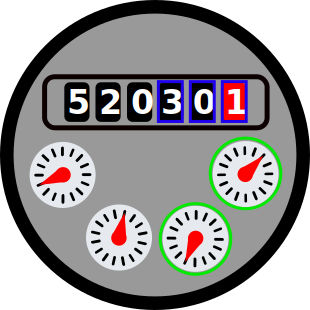

# Welcome to the AI-on-the-edge-device

Artificial intelligence based systems have become established in our everyday lives. Just think of speech or image recognition. Most of the systems rely on either powerful processors or a direct connection to the cloud for doing the calculations there. With the increasing power of modern processors, the AI systems are coming closer to the end user – which is usually called **edge computing**.
Here, this edge computing is put into a practically oriented example, where an AI network is implemented on an ESP32 device so: **AI on the edge**.

This project allows you to digitize your **analog** water, gas, power and other meters using cheap and easily available hardware.

All you need is an [ESP32 board with a supported camera](https://jomjol.github.io/AI-on-the-edge-device-docs/Hardware-Compatibility/) and something of a practical hand.

## Key features
- Tensorflow Lite (TFlite) integration – including easy-to-use wrapper
- Inline image processing (feature detection, alignment, ROI extraction)
- **Small** and **cheap** device (3 x 4.5 x 2 cm³, < 10 EUR)
- Integrated camera and illumination
- Web interface for administration and control
- OTA interface for updating directly via the web interface
- Full integration into Homeassistant
- Support for Influx DB 1
- MQTT
- REST API

## Workflow
The device takes a photo of your meter at a defined interval. It then extracts the Regions of Interest (ROIs) from the image and runs them through artificial intelligence. As a result, you get the digitized value of your meter.

There are several options for what to do with that value. Either send it to an MQTT broker, write it to an InfluxDb or simply provide access to it via a REST API.

 

## Impressions
### AI-on-the-edge-device on a Water Meter
 

### Web Interface (Water Meter)
 

### AI-on-the-edge-device on a Electrical Power Meter
 

## Setup
There is growing [documentation](https://jomjol.github.io/AI-on-the-edge-device-docs/) which provides you with a lot of information. Head there to get a start, set it up and configure it.

There are also articles in the German Heise magazine "make:" about the setup and technical background (behind a paywall): [DIY - Setup](https://www.heise.de/select/make/2021/2/2103513300897420296)

For further background information, head to [Neural Networks](https://www.heise.de/select/make/2021/6/2126410443385102621), [Training Neural Networks](https://www.heise.de/select/make/2022/1/2134114065999161585) and [Programming on the ESP32](https://www.heise.de/select/make/2022/2/2204010051597422030).

### Download
The latest available version can be found on the [Releases page](https://github.com/jomjol/AI-on-the-edge-device/releases).

### Flashing the ESP32
Initially you will have to flash the ESP32 via a USB connection. Later updates are possible directly over the air (OTA).

There are different ways to flash your ESP32:
- [Web Installer and Console](https://jomjol.github.io/AI-on-the-edge-device/index.html) (Browser-based tool to flash the ESP32 and extract the log over USB)
- Flash Tool from Espressif
- ESPtool (command-line tool)

See the [documentation](https://jomjol.github.io/AI-on-the-edge-device-docs/Installation/) for more information.

### Flashing the SD Card
The SD card must be flashed separately, see the [documentation](https://jomjol.github.io/AI-on-the-edge-device-docs/Installation/) for details.

## Casing

A 3D-printable housing can be found here:
  - https://www.thingiverse.com/thing:4573481 (Water Meter)
  - https://www.thingiverse.com/thing:5028229 (Power Meter)
  - https://www.thingiverse.com/thing:5224101 (Gas Meter)
  - https://www.thingiverse.com/thing:4571627 (ESP32-cam housing only)

## Build It Yourself
See [Build Instructions](code/README.md).

## Donate
If you would like to support the developer with a cup of coffee, you can do that via [PayPal](https://www.paypal.com/donate?hosted_button_id=8TRSVYNYKDSWL).

<form action="https://www.paypal.com/donate" method="post" target="_top">
<input type="hidden" name="hosted_button_id" value="8TRSVYNYKDSWL" />
<input type="image" src="https://www.paypalobjects.com/en_US/DK/i/btn/btn_donateCC_LG.gif" border="0" name="submit" title="PayPal - The safer, easier way to pay online!" alt="Donate with PayPal button" />

</form>

If you have any technical problems, you can create an [Issue](https://github.com/jomjol/AI-on-the-edge-device/issues).

In other cases you can contact the developer via email: 

## Changes and History 
See [Changelog](Changelog.md).

## Tools

* Logfile downloader and combiner (Thx to [reserve85](https://github.com/reserve85))
  * Files see ['/tools/logfile-tool'](tbd), how-to see [documentation](https://jomjol.github.io/AI-on-the-edge-device-docs/outdated--Gasmeter-Log-Downloader/)

## Additional Ideas
There are some ideas and feature requests which are not currently being pursued – mainly due to capacity reasons on the part of the developer. They are collected here: [FeatureRequest.md](FeatureRequest.md).

------

